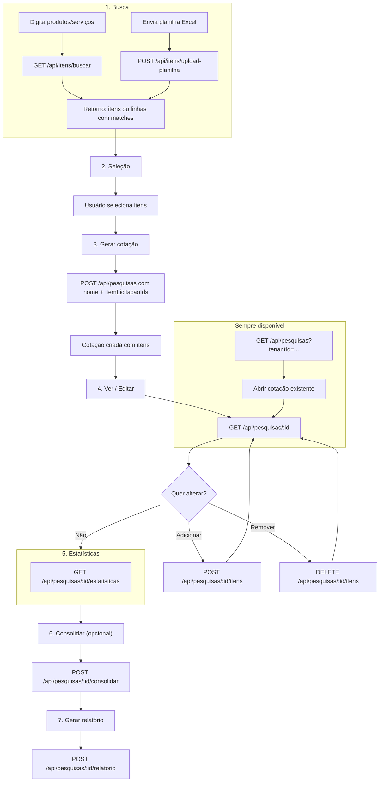

# Fluxo do usuário — Cotação de preços

Este documento descreve o fluxo que o usuário (servidor público) segue no app e quais rotas da API são usadas em cada etapa.

---

## Visão geral

1. **Busca** — por texto OU por planilha Excel → sistema retorna itens (ou sugestões por linha).
2. **Seleção** — usuário escolhe quais itens entram na cotação.
3. **Gerar cotação** — cria a cotação já com os itens selecionados.
4. **Ver / editar cotação** — adicionar ou remover itens.
5. **Estatísticas** — média, mediana, menor/maior preço, outliers.
6. **Consolidar** (opcional) — finalizar a cotação.
7. **Gerar relatório** — PDF/Word para anexar ao processo.

Em qualquer momento o usuário pode **listar** e **abrir** cotações existentes.

---

## Diagrama do fluxo

---

## Passo a passo com as rotas

| # | Ação do usuário | Rota | Observação |
|---|------------------|------|------------|
| 1a | Busca por texto (ex.: "notebook") | `GET /api/itens/buscar?q=...` | Opcional: `lat`, `lng`, `raioKm` para filtro geográfico. |
| 1b | Envia planilha Excel | `POST /api/itens/upload-planilha` (multipart, campo `arquivo`) | Retorna `linhas` com `descricaoOriginal` e `matches` (itens sugeridos). |
| 2 | Seleciona itens (na tela) | — | Front monta lista de `itemLicitacaoIds` (da busca ou dos matches da planilha). |
| 3 | Clica em "Gerar cotação" | `POST /api/pesquisas` com `nome`, `tenantId`, `usuarioId`, `itemLicitacaoIds` | Cotação criada já com os itens. |
| 4a | Abre a cotação | `GET /api/pesquisas/:id` | Ver pesquisa + itens. |
| 4b | Adiciona mais itens | `POST /api/pesquisas/:id/itens` com `itemLicitacaoIds` | Refinar cotação. |
| 4c | Remove itens | `DELETE /api/pesquisas/:id/itens` com body `{ itemLicitacaoIds }` | Refinar cotação. |
| 5 | Vê estatísticas | `GET /api/pesquisas/:id/estatisticas` | Média, mediana, outliers, lista de itens com `isOutlier`. |
| 6 | Finaliza cotação (opcional) | `POST /api/pesquisas/:id/consolidar` | Retorna estatísticas; no futuro pode marcar status "finalizada". |
| 7 | Gera relatório | `POST /api/pesquisas/:id/relatorio` | Body opcional `{ tipo: 'pdf' \| 'word' }`. Retorna URL/hash (placeholder). |
| — | Lista minhas cotações | `GET /api/pesquisas?tenantId=...` | Para abrir uma existente (editar, estatísticas ou relatório). |

---

## Planilha Excel

- **Formato:** .xlsx ou .xls.
- **Colunas detectadas:** descrição (obrigatória) — busca por coluna cujo nome contenha "desc", "item", "produto" ou "especificação"; quantidade e unidade (opcionais) — colunas com "quantidade"/"qtd" e "unidade"/"um".
- **Limite:** 200 linhas por arquivo; 5 MB.
- **Resposta:** Para cada linha com descrição preenchida, o backend faz busca textual no histórico e retorna até 10 itens sugeridos (`matches`). O usuário escolhe no front quais matches usar e envia os `id` em `POST /api/pesquisas` (criar cotação com itens).
